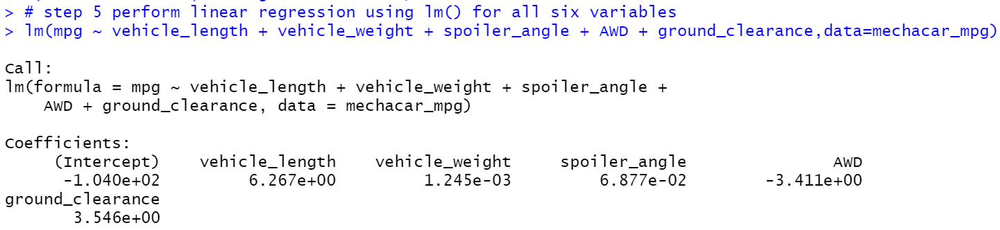

# MechaCar Statistical Analysis

## Linear Regression to Predict MPG

The MechaCar_mpg.csv file was read into R-Studio as a dataframe. Linear regression using the lm() function was passed to all six variables in the dataframe. Finally, the summary() function was used to determine p-Value and r-squared values for the linear regression model. The results are shown in the images below:

1. Which variables/ coefficients provided a non-random amount of variance to the MPG values in the dataset?
  * Vehicle length and vehicle ground clearance are likely to provide non-random amounts of variance to the model. The vehicle length and vehicle ground clearance have a statistically significant impact on miles per gallon on the MechaCar prototype. Vehicle weight, spoiler angle, and All Wheel Drive (AWD) have p-Values that indicate a random amount of variance in the dataset.

2. Is the slope of the linear model considered to be zero? Why or why not?
 * The p-Value of 5.35e-11 is smaller than the normal significance level of 0.05, and rejects the null hypothesis that the slope is equal to zero.

3. Does this linear model predict MPG of MechaCar prototypes effetively? Why or why not?
 * The r-squared value in the multiple regression model has a probability of ~71%, which suggests using this model will result in approximately 71% accurracy in prediciting MPG efficiency. 

## Summary Statistics on Suspension Coils

Short summary to address:

