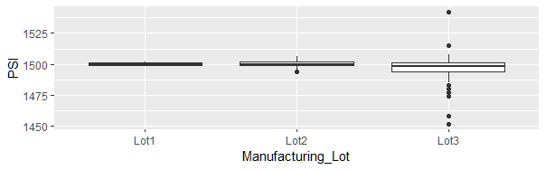
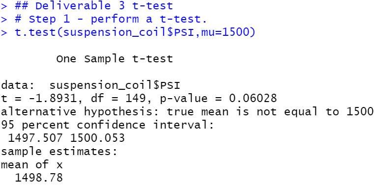
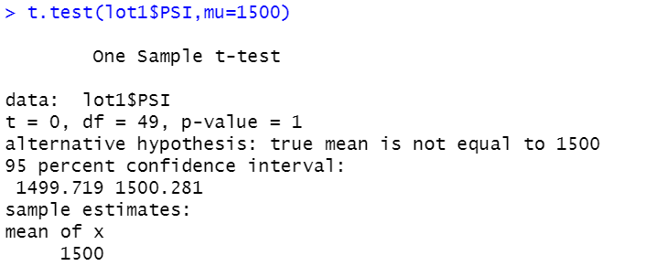
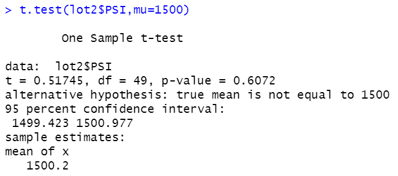

# MechaCar Statistical Analysis

## Linear Regression to Predict MPG (D1)

The MechaCar_mpg.csv file was read into R-Studio as a dataframe. Linear regression using the lm() function was passed to all six variables in the dataframe. Finally, the summary() function was used to determine p-Value and r-squared values for the linear regression model. The scripts are available in the R-Script file <a href='R_Analysis/.Rhistory'>here</a>, and the results are shown in the images below:

1. Which variables/ coefficients provided a non-random amount of variance to the MPG values in the dataset?
  * Vehicle length and vehicle ground clearance are likely to provide non-random amounts of variance to the model. The vehicle length and vehicle ground clearance have a statistically significant impact on miles per gallon on the MechaCar prototype. Vehicle weight, spoiler angle, and All Wheel Drive (AWD) have p-Values that indicate a random amount of variance in the dataset.

2. Is the slope of the linear model considered to be zero? Why or why not?
 * The p-Value of 5.35e-11 is smaller than the normal significance level of 0.05, and rejects the null hypothesis that the slope is equal to zero.

3. Does this linear model predict MPG of MechaCar prototypes effetively? Why or why not?
 * The r-squared value in the multiple regression model has a probability of ~71%, which suggests using this model will result in approximately 71% accurracy in prediciting MPG efficiency. 

## Summary Statistics on Suspension Coils (D2)
The Suspension_Coil.csv file was read into R-Studio as a datatframe and RSript used to create a total_summary and lot_summary dataframe. The summarize() function was used to obtain mean, median, variance and standard deviation from the suspension coil's PSI column for both summaries, and the group_by() function used to group by manufacturing lots in the lot_summary dataframe. Below images show output results:

### Total Summary Results

### Manufacturing Lot Summary Results

### Deeper Dive: Box and Whisker Plot by Manufacturing Lot

The design specifications for the MechaCar suspension coils dictate that the variance of the suspension coils must not exceed 100 pounds per square inch. Does the current manufacturing data meet this design specification for all manufacturing lots in total and each lot individually? Why or why not?

#### Results:
Total Summary
1. The total summary indicates a normal distribution, with a mean of 1498.78 PSI and median of 1500
2. Variance of 62.29 is within the allowed 100 pounds per square inch.

Lot Summary
1. Lot 1 and 2 are both within the allowed PSI variance of 100 PSI
2. Lot 1 and 2 have a mean and median of 1500 PSI
3. Lot 3 mean and median are below 1500 PSI
4. Lot 3 variance is 170.29, and is outside the allowable range of 100 PSI manufacturer specification

Although the total summary statistics indicate the coils meet the PSI specifications, the manufacturing lot summary indicates a problem with lot 3, because the variance is outside the allowed manufacturer's specifications. When examining the box and whisker chart above, it is clear there are several observations in lot 3 data that are outliers, and the data suggests a need to investigate the coil manufacturing processes in this lot.

## T-Tests on Suspension Coils (D3)
Using the suspension coil's dataframe, create a one-sample t-test of the data and then three more by lot subset to determine if the PSI for each manufacturing lot is statistically different from the population mean of 1,500 PSI.

### T-Test Results

#### One-sample T-Test of all Manufacturing Lots

#### One-sample T-Test of Each Manufacturing Lot
Lot 1

Lot 2

Lot 3

### Deliverable 3 Summary Results
1. The mean of the sample is 1498.78 with a p-Value of 0.06, which is higher than the normal significance level of 0.05. There is not enough evidence to reject the null hypothesis. The mean of all manufacturing lots is statistically similar to the population mean of 1500.
2. The mean for manufacturing lot 1 is 1500 with a p-Value of 1. There is no statistical difference between the observed sample mean and the population mean (1500), and the null hypothisis cannot be rejected.
3. The mean for manufacturing lot 2 is 1500 with a p-Value of 0.6072. There is no statistical difference between the observed sample mean and the population mean (1500), and the null hypothisis cannot be rejected.
4. The mean for manufacturing lot 3 is 1496.14 with a p-Value of 0.04168, which is below the normal significance level of 0.05. There is enough evidence to reject the null hypothesis that this sample mean and the population mean are not statistically different.

## Study Design: MechaCar vs Competition (D4)
Design a statistical study that can quantify how MechaCar performs against the competition. Identify one or more metrics of interest to consumers.

### Study
This statistical study will examine how MechaCar's highway fuel efficiency and safety ratings compare to similar competitor's models and whether these two metrics have an impact on selling price. Consumers are interested in economy and safety when purchasing a vehicle, and quantifying these metrics may aid in targeting buyer populations. Data will need to include a sample of vehicle models similar to MechCar's model, with a mininum sample of 30 observations.

#### Metrics
* Selling price as a dependent variable
* Safety rating as an independent variable
* Miles per Gallon (MPG) as a independent variable

#### Hypothoses (Null and Alternative)
* Null hypothesis: safety ratings and fuel economy have an impact on selling price
* Alternative hypothesis: safety ratings and fuel economy have no impact on selling price

### Testing the Hypothesis

